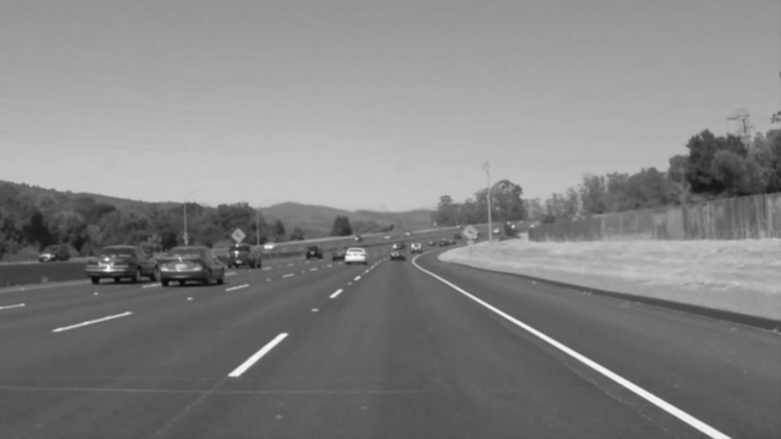
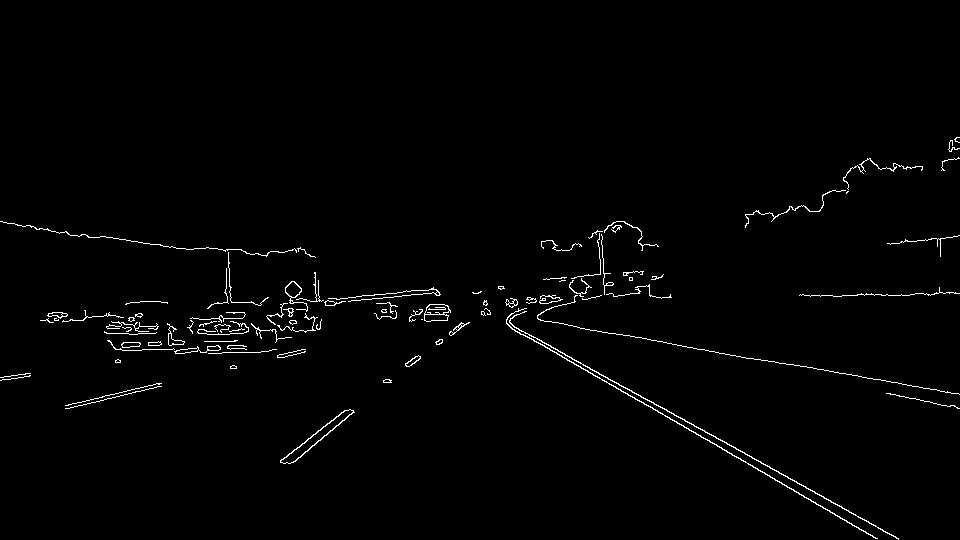
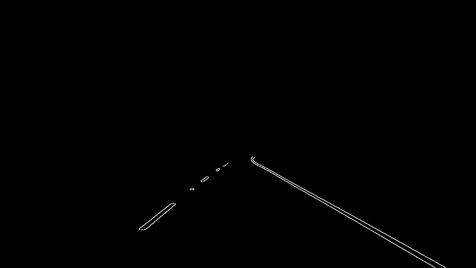
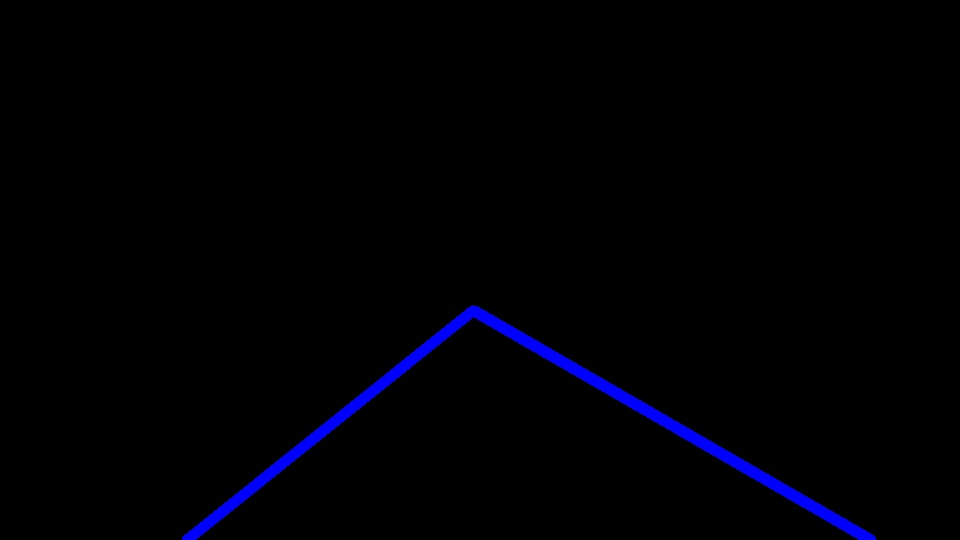
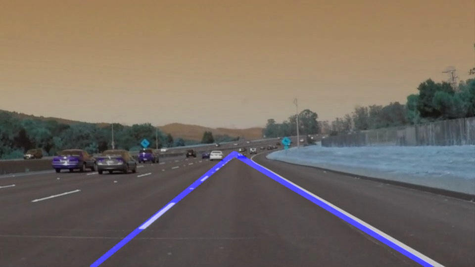
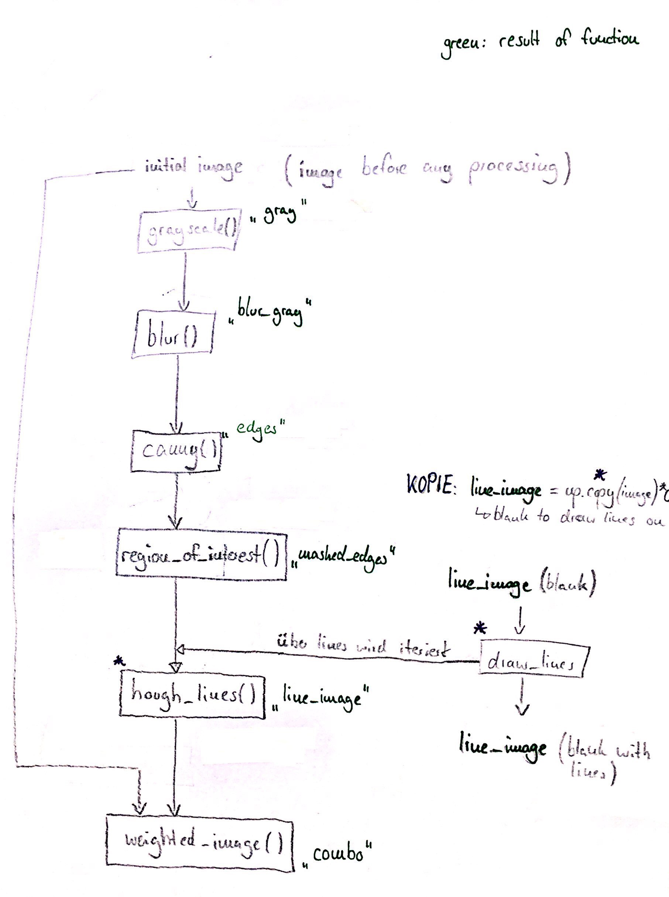

# **Finding Lane Lines on the Road** 

Overview
---

When we drive, we use our eyes to decide where to go. The lines on the road that show us where the lanes are act as our constant reference for where to steer the vehicle.  Naturally, one of the first things we would like to do in developing a self-driving car is to automatically detect lane lines using an algorithm.

In this project we will detect lane lines in images using Python and OpenCV.  OpenCV means "Open-Source Computer Vision", which is a package that has many useful tools for analyzing images.

[//]: # (Image References)

[image1]: ./examples/gray.jpg "gray"
[image2]: ./examples/blur_gray.jpg "blur_gray"
[image3]: ./examples/edges.jpg "edges"
[image4]: ./examples/masked_edges.jpg "masked_edges"
[image5]: ./examples/line_image.jpg "line_image"
[image6]: ./examples/combo.jpg "combo"
[image7]: ./examples/pipeline.jpg "pipeline"

---

Pipeline
---

### 1. Description of the pipeline.

My pipeline consists of 6 steps:

1) First, I converted the initial images ("image") to grayscale ("gray"):

2) Second, I blurred the images with Gaussian blurring ("blur_gray"):

3) Third, I canny-edged the images. This algorithm detects pixels whose adjacent pixels have quite different values. In the resulting image you can only see the silhouettes ("edges"):

4) Now a mask is applied to the canny-edged images. This means only a defined region of the image is kept. The rest of the image is set to black ("masked_edges"):

5) The images can now be used for hough transformation. This algorithm is able to detect lines in images. Every pixel can be represented as a sine-curve in rho-theta-parameter space the so-called hough space. Intersections of sine-curves in hough space represent detected lines. The function cv2.HoughLinesP() writes the endpoints (x1, y1, x2, y2) of the detected lines into a simple array. The detected lines are drawn on a blank copy (same dimensions with values set to 0) of the initial image or canny-edged image (no matter because they have the same dimensions). NOTE: The output of the function hough_lines() includes hough transformation, line detection, copying the initial image and drawing the detected lines on the blank copy. Drawing is realized by the function draw_lines(). The result is "line_image":

6) In the final step, the initial image is combined with the line_image using the function weighted_image(). The resulting image "combo" is computed as follows: initial_img * α (=0.8) + line_img * β (=1.) + γ (=0)

Additional infos to step 5): In order to draw a single line - and not just a lot of line segments - on the left and right lanes, I modified the draw_lines() function as followed:

1) All the detected lines have an individual slope m and intercept b. For each line these both parameters are being computed (m = (y2-y1)/(x2-x1) and b = y1 - m*x1) and written into a dedicated array to use them later. For example all slopes m from line segments belonging to the left lane are written to the array lm = np.array(()). How to know that line segments belong to the left lane in this example? The left lane has negative slope (attention: y-axis goes down!). So only if the condition slope < 0 is fulfilled, the slope of the analysed line segment is being written into the lm-array.

2) Now we have a long list with many values for slopes and intercepts. To find one corresponding slope respectively intercept the array is used to compute the average, e.g. the values in lm are used to compute the average slope of the left lane "lm_avg". Same happens to the intercept of the left lane, slope and intercept of the right lane.

3) For each lane, two points can be computed. One point is where y = 540 in order to start at the bottom of the image and meet the requirements. The second point is the y-coordinate of the apex of the region of interest which is y = 310.

### Here is a schematic representation of the full pipeline:

![alt text][image7]

### 2. Potential shortcomings with the current pipeline

1) One potential shortcoming would be what would happen when the sun shines on the road in a bad angle? The edge detection of white lanes gets worse because the whole image is bright an adjacent pixels have quite similar color values. Edges cannot reliably be detected. 

2) Another shortcoming could be that lines are not detected perfectly on the right position and lanes is detected as smaller or bigger than in real. The result are flouncing detected lanes on the video.

### 3. Possible improvements to the pipeline

( 1) Out of scope because this is not an improvement for this pipeline: A possible improvement would be to use not only camera-generated data but also location data in combination to HD maps to find the drivable lane without the needing lane lines at all.)

2) Another potential improvement could be to adjust the hough parameters in order to detect lines more precisely on the right position without flouncing. Further the lines could be shortened and not go fully to the apex of the region.

3) Another potential improvement could be to improve the vertices of the interested region and to let them dynamically change (not fixed values as is). As example, the apex could be defined as intersection of the dynamically detected lines.
